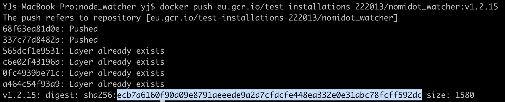

# @substrate/node-watcher
Long living script that reads from an archive node and loads select information to a Postgresql DB, a.k.a ETL.

The tasks specific to Nomidot are in `src/tasks`

The script itself lives in `nodeWatcher.ts`, and anyone can write their own `tasks` suited to their needs as long as they conform to the `Task` interface. It is agnostic of what server or db one decides to use.

### Instructions to run locally:
1. Push up the Postgresql and Prisma images: `docker-compose up -d`
2. Run the script which populates the database: `yarn start`

### On a Local Kubernetes Cluster (minikube) (writes to CloudSQL)
1. Start local cluster `minikube start`
2. Make sure kubectl is connected to is `kubectl cluster-info`
3. Follow same steps as below

### On Hosted Google Kubernetes Engine
1. Mount secrets to nodewatcher pod's volume: `kubectl create -f path/to/secrets.yaml`
<!-- 2. Mount configmaps to cluster: `kubectl create -f path/to/configmaps.yaml` -->
3. Create namespaces: `kubectl create -f path/to/namespace.yaml`
  - Make sure you're in the appropriate namespace: `kubectl config set-context --current --namespace<namespace>`
  - Verify: `kubectl config view --minify | grep namespace:`
4. Create nodewatcher deployment: `kubectl create -f path/to/nodewatcher_deployment.yaml`
5. Create service: `kubectl create -f path/to/service.yaml`
6. Get the nodewatcher deployment IP: `kubectl describe deployments nodewatcher` 
7. Set `PRISMA_ENDPOINT` in `nomidotwatcher-deployment.yaml` to External IP from step 6.
8. Allow traffic: `gcloud compute firewall-rules create allow-nodewatcher-nodeport --allow=tcp:31000`

### Make a rolling update:
  - Docker Tag the new image(s) `docker tag node_watcher_main eu.gcr.io/kusama-etl/node_watcher:v1.0`
  - Push it to container registry `docker push eu.gcr.io/kusama-etl/node_watcher:v1.0`
  - Get the current image name `kubectl describe pods ${POD_NAME}`
  - Set new deployment image `kubectl set image ${current_image} ${new_image}`
  - Confirm with `kubectl rollout status deployments/${new_image}`

### PgAdmin into Cloudsql using Proxy

##### Cloudsql Proxy
  - Make sure Cloudsql Proxy is installed: `curl -o cloud_sql_proxy https://dl.google.com/cloudsql/cloud_sql_proxy.darwin.amd64`
  - Make it executable: `chmod +x cloud_sql_proxy`
  - Locate the `credentials.json` file containing credentials to the service account.
  - Start the proxy: `./cloud_sql_proxy -instances=test-installations-222013:europe-west1:kusama-etl=tcp:0.0.0.0:5432 -credential_file=./key.json`
  - It should say something like:
  ```
    Listening on 127.0.0.1:5432 for test-installations-222013:europe-west1:kusama-etl
    2020/01/30 17:05:37 Ready for new connections
  ```

##### PgAdmin
  - Get pgadmin: https://hub.docker.com/r/dpage/pgadmin4/
  - Run it: `docker run -p 80:80 -e PGADMIN_DEFAULT_EMAIL="name@parity.io" -e PGADMIN_DEFAULT_PASSWORD="****" -d dpage/pgadmin4`
  - Navigate to `localhost:80` in a browser
  - Login with the above credentials
  - Click "New Server"
  - In "Connection" tab, fill in the DB_NAME (e.g. nomidot-node-watcher), DB_USER (e.g. admin), and DB_PASS, as appropriate.
  - Make sure `SSL mode` is set to `Disabled`. **n.b.** "Even though the sslmode parameter is set to disabled, the proxy does provide an encrypted connection."

  - Click Connect.

##### Port Forwarding
It is also possible to forward our `localhost:4467` to our cluster port `:4466` with, port forwarding. This will allow us to go to open the GraphQl interface from our local machine.

1. `kubectl get pods --namespace nomidotwatcher-staging`
2. `kubectl port-forward --namespace nomidotwatcher-staging <the-pod-name> 4467:4466`

Then just go to localhost:4467 in a browser and that will forward your requests to the cluster's 4466 port (where the deployed Prisma server lives).

You can also deploy a new prisma schema by setting the PRISMA_ENDPOINT environment variable to be localhost:4467, and running prisma deploy, e.g. `PRISMA_ENDPOINT="http://127.0.0.1:4467" START_FROM="66647" yarn prisma deploy`

##### Updating Kubernetes Job
1. Make sure you're logged into gcloud with an account that has access to Container Registry. You can also push to Docker Hub but for the sake of having everything in one place, we'll keep it all in GCR.

2. Run `gcloud auth configure-docker`
3. Check the last build image version with `gcloud container images list-tags eu.gcr.io/test-installations-222013/nomidot_watcher`
4. Making sure you're on the appropriate branch, build a new image. `docker build -t nomidot_watcher:v1.2.15 .`

5. Tag that image in the appropraite format for GCR e.g `docker tag nomidot_watcher:v1.2.15 eu.gcr.io/test-installations-222013/nomidot_watcher:v1.2.15`

6. Push that image with `docker push eu.gcr.io/test-installations-222013/nomidot_watcher:v1.2.15`

7. Copy the SHA256 hash

8. Paste it into the job config

9. Create the job `kubectl create -f /path/to/config.yaml`

10. Check it's running `kubectl get jobs`, `kubectl logs -l job-name={jobname} -n nodewatcher-staging`

11. Eventually delete the outdated job too `kubectl delete jobs old-job-name`
