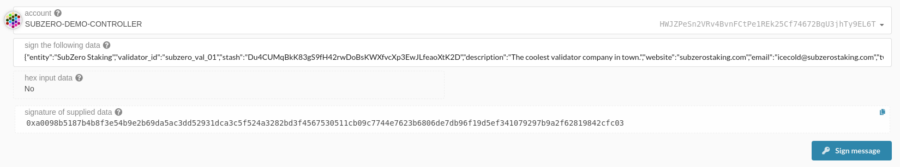
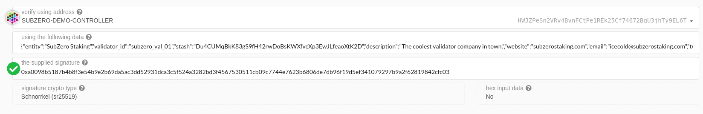

## Introduction

This JSON file serves as a list of validators who want to connect off-chain information about their validator(s) with their validators. All the information is signed by the Controller key so that users can verify its source.

As an example, Nomidot (or other UIs) may want to give users the option to see all validators operated by Your-Staking-Company. You can enter that as the `entity` and have multiple `validator_id`s if you run more than one node. You can also provide other information, such as a website or contact method. This is for _off-chain_ information. It is linked to information on chain, like commission, by your Stash address.

At a minimum, please enter `entity`, `validator_id`, and `stash` for each validator that you run. Additional fields are up to you.

> **Note:** You will need to update this if you change your Controller or add/remove validators.

## How to Sign

### 1. Fill out the information.

Enter your information. Don't worry about `signature` yet. Example:

```
{
	"info" : {
		"entity" : "SubZero Staking",
		"validator_id" : "subzero_val_01",
		"stash" : "Du4CUMqBkK83gS9fH42rwDoBsKWXfvcXp3EwJLfeaoXtK2D",
		"description" : "The coolest validator company in town.",
		"website" : "subzerostaking.com",
		"email" : "icecold@subzerostaking.com",
		"twitter" : "https://twitter.com/joepetrowski",
		"github" : "https://github.com/joepetrowski"
	},
	"signature" : 
},
```

### 2. Signing

Polkadot JS has a page where you can sign messages: https://polkadot.js.org/apps/#/toolbox/sign

First, it will ask you to select a key and unlock the account. Choose your Controller. Copy all the `info` data from `{` to `}` (inclusive) and paste it into the textbox. Remove all tabs, spaces, and newline characters.

> TODO: Make a more structured method of putting this in a good format.

```
{"entity":"SubZero Staking","validator_id":"subzero_val_01","stash":"Du4CUMqBkK83gS9fH42rwDoBsKWXfvcXp3EwJLfeaoXtK2D","description":"The coolest validator company in town.","website":"subzerostaking.com","email":"icecold@subzerostaking.com","twitter":"https://twitter.com/joepetrowski","github":"https://github.com/joepetrowski"}
```



When you click "Sign Message", it will return a signature:

```
0xa0098b5187b4b8f3e54b9e2b69da5ac3dd52931dca3c5f524a3282bd3f4567530511cb09c7744e7623b6806de7db96f19d5ef341079297b9a2f62819842cfc03
```

You can [verify](https://polkadot.js.org/apps/#/toolbox/verify) that this signature works:



Add the signature to the `signature` field.

```
{
	"info" : {
		"entity" : "SubZero Staking",
		"validator_id" : "subzero_val_01",
		"stash" : "Du4CUMqBkK83gS9fH42rwDoBsKWXfvcXp3EwJLfeaoXtK2D",
		"description" : "The coolest validator company in town.",
		"website" : "subzerostaking.com",
		"email" : "icecold@subzerostaking.com",
		"twitter" : "https://twitter.com/joepetrowski",
		"github" : "https://github.com/joepetrowski"
	},
	"signature" : "0xa0098b5187b4b8f3e54b9e2b69da5ac3dd52931dca3c5f524a3282bd3f4567530511cb09c7744e7623b6806de7db96f19d5ef341079297b9a2f62819842cfc03"
},
```

### 3. Make a PR

Add your data to the `validator_list.json` file, sorted alphabetically by `entity` name.
